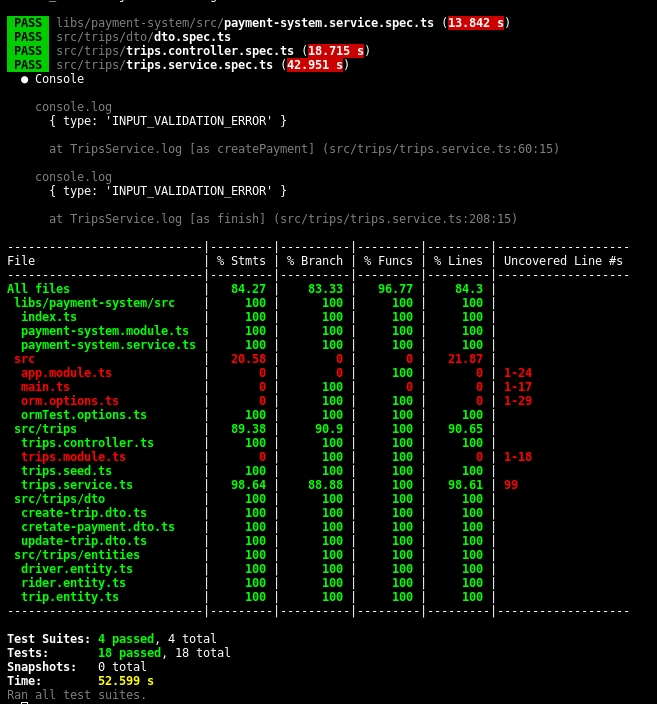

# Alucar

## Description

Backend development of payment system implemented for rides application using [Nest](https://github.com/nestjs/nest), this app is already running on Render free server, try it on https://alucar.onrender.com (this server down with inactivity, and wake up after a petition, maybe the first petition can return timeout, just resend the request in that case)

## Installation

```bash
$ npm install
```

## Config

Create a .env file which collet the env vars of the application

```ini
NODE_ENV=development
PORT=3000
DB_HOST=localhost
DB_NAME=alucar
DB_USER=admin
DB_PASSWORD=password
DB_PORT=5432
DB_SCHEMA=public
WOMPI_URL=https://sandbox.wompi.co/v1
WOMPI_PUB_KEY=pub_test_1234
WOMPI_PRV_KEY=prv_test_1234
WOMPI_INTE_KEY=test_integrity_1234
```

Then run the next command for create tables and populate your db with default seed

```bash
# This command drop your db before seed, but is needed for create the db structure of tables
$ npm run db:rebuilt
```

## Running the app

```bash
# development
$ npm run start

# watch mode
$ npm run start:dev

# production mode
$ npm run start:prod
```

## Docker

```bash
# create docker image
$ docker build --tag alucar-img .
# run docker pod
$ docker run -p <PORT>:<PORT> --env-file .env --name alucar -it alucar-img
```

## Test

Check always if your env vars for Wompi payment process are in sandbox mode, for prevent real transactions

```bash
# tests
$ npm run test

# e2e tests
$ npm run test:e2e
```

### Coverage 

Restult of the test coverage in the project:



## Endpoint Documentation

### Create a payment method

| Endpoint                                           | Description               |
| -------------------------------------------------- | ------------------------- |
| `POST /api/v1/trips/createPaymentService/:riderID` | Register a payment method |

#### Request params

| Parameter                   | Type   | Description                                     |
| --------------------------- | ------ | ----------------------------------------------- |
| `riderID`                   | Number | Id of the rider                                 |
| `tokenized_payment`         | String | Pretokenized payment method                     |
| `acceptance_token`          | String | Pregenerated acceptance token                   |
| `payment_type` _(optional)_ | String | Payment type ["CARD", "NEQUI"] default = "CARD" |

#### Request body example

```json
{
  "tokenized_payment": "token_example",
  "acceptance_token": "acceptance_example"
}
```

#### Successfully response

```json
{
  "message": {
    "text": "Payment source successfully register"
    // Otros detalles de la respuesta
  }
}
```

#### Response codes

- 201 Created: Payment source successfully register.
- 400 Bad Request: Incorrect of invalid parameters in request.
- 500 Internal Server Error: Internal server error.

### Start new trip

| Endpoint                      | Description     |
| ----------------------------- | --------------- |
| `POST /api/v1/trips/:riderID` | Create new trip |

#### Request params

| Parameter                 | Type     | Description                                                 |
| ------------------------- | -------- | ----------------------------------------------------------- |
| `riderID`                 | Number   | Id of the rider                                             |
| `startLocation`           | Object   | Coordinates where the trip start                            |
| `startLocation.latitude`  | Number   | Latitude of coordinates                                     |
| `startLocation.longitude` | Number   | longitude of coordinates                                    |
| `startTime` _(optional)_  | Datetime | Iso format of date when the trip start default = new Date() |

#### Request body example

```json
{
  "startLocation": {
    "latitude": 1.2,
    "longitude": 2.3
  }
}
```

#### Successfully response

```json
{
  "message": {
    "text": "Trip start successfully",
    "driver": {
      // Detalles del conductor
    }
  }
}
```

#### Response codes

- 201 Created: Viaje iniciado exitosamente.
- 202 Accepted: No available drivers at this moment.
- 400 Bad Request: Incorrect of invalid parameters in request.
- 500 Internal Server Error: Internal server error.

### Finalize trip

| Endpoint                         | Description  |
| -------------------------------- | ------------ |
| `DELETE /api/v1/trips/:driverID` | End the trip |

#### Request params

| Parameter               | Type     | Description                                               |
| ----------------------- | -------- | --------------------------------------------------------- |
| `riderID`               | Number   | Id of the rider                                           |
| `endLocation`           | Object   | Coordinates where the trip end                            |
| `endLocation.latitude`  | Number   | Latitude of coordinates                                   |
| `endLocation.longitude` | Number   | longitude of coordinates                                  |
| `endTime` _(optional)_  | Datetime | Iso format of date when the trip end default = new Date() |

#### Request body example

```json
{
  "endLocation": {
    "latitude": -1.1,
    "longitude": 0.3
  }
}
```

#### Successfully response

```json
{
  "message": {
    "text": "Trip finalized with successfully payment"
    // Otros detalles de la respuesta
  }
}
```

#### Response codes

- 202 Accepted: Trip finalized with successfully payment.
- 400 Bad Request: Incorrect of invalid parameters in request.
- 500 Internal Server Error: Internal server error.
